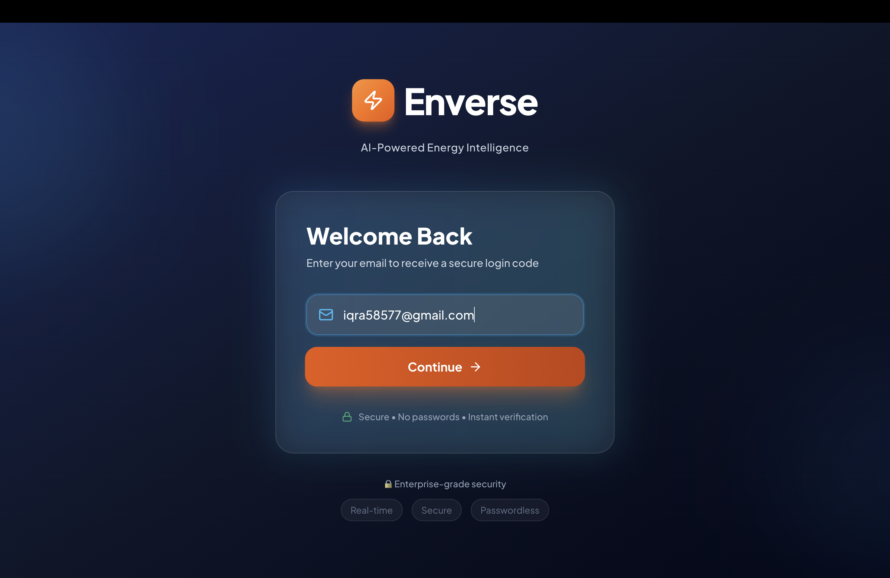
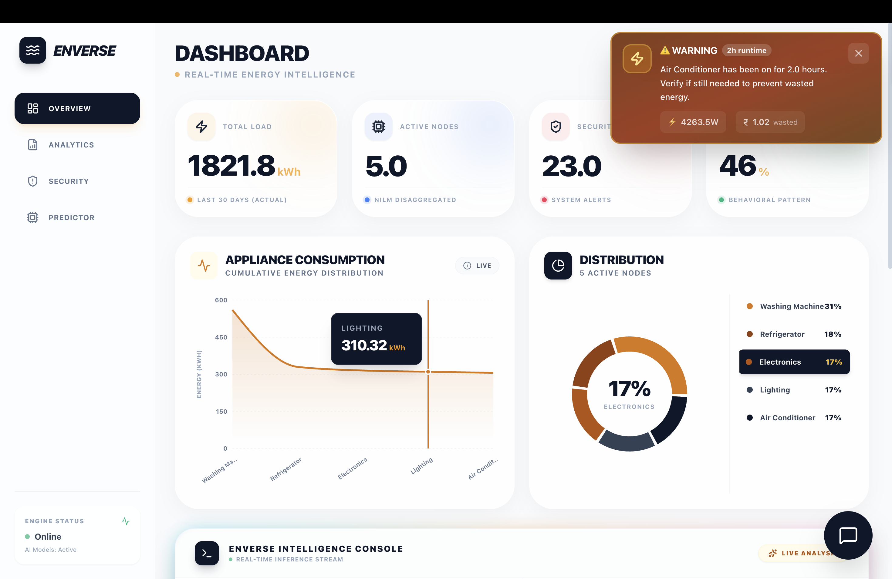
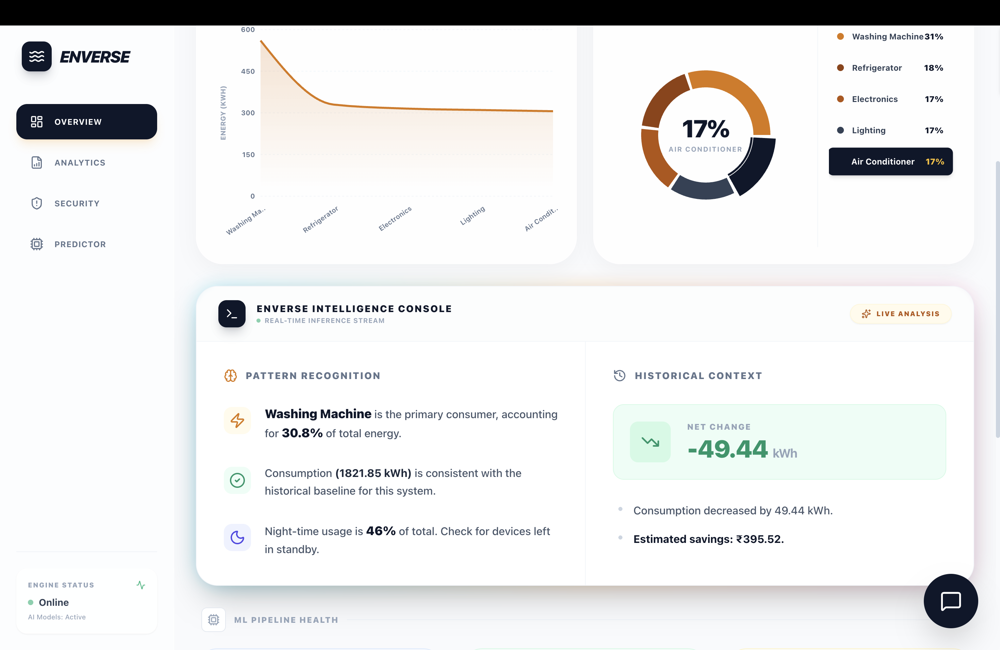
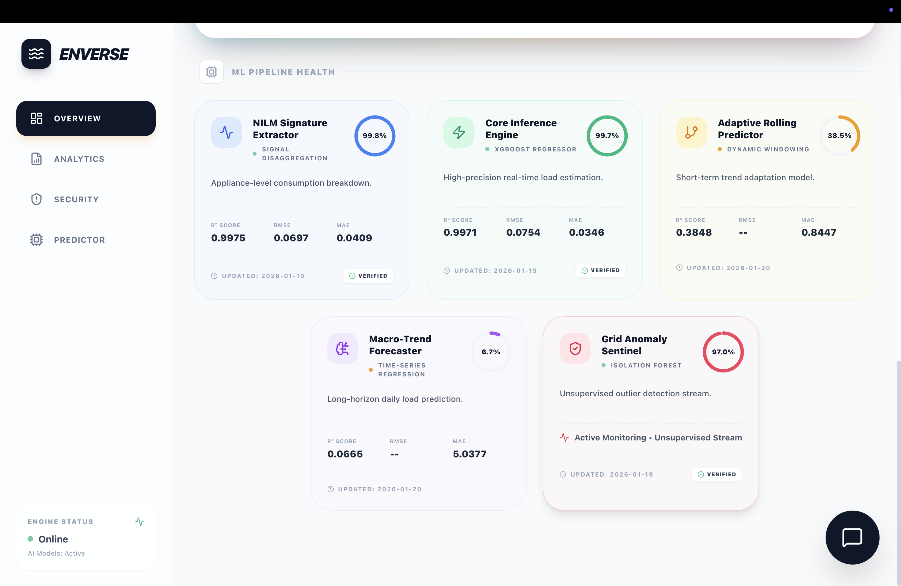
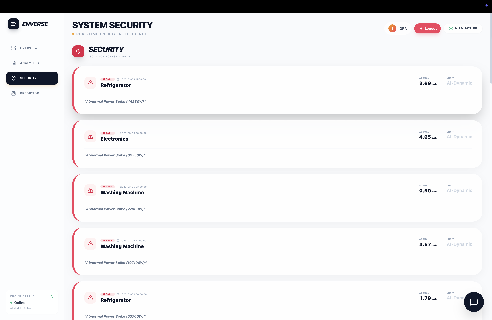

# Enverse — Energy Intelligence Platform

A full-stack energy intelligence platform that turns time-series energy usage data into **appliance-level insights**, **forecasts**, **anomaly alerts**, and a **natural-language energy assistant**.

**Tech:** FastAPI (Python) • React + TypeScript + Vite • XGBoost • Isolation Forest • SHAP • Groq (LLM)

> **Live dashboard (API-driven):** the UI is powered by backend APIs with refresh-based fetching (not streaming/WebSockets).

---

## Demo
- 🎥 **Video walkthrough:** [Click here to watch the full platform demo](https://drive.google.com/file/d/10_RpEICfhTN9pnwdEslEIWD_MWbElFfi/view?usp=drive_link)

---

## Screenshots
> Images live in `docs/screenshots/`.

### 1) Secure Authentication (OTP-based login)


### 2) Live Energy Intelligence Dashboard


### 3) Intelligent AI Insights


### 4) Machine Learning Pipeline Monitoring


### 5) Appliance Deep-Dive Analysis (Device Drawer)


### 6) AI-Based Anomaly Detection (System Security)


### 7) Energy Consumption Forecasting + Impact Simulator


### 8) LLM-Powered Energy Assistant (Groq)


### 9) Mobile-Responsive UI (Cross-Device Support)


---

## Features
- **Live dashboard (API-driven):** appliance-wise kWh breakdown, bill estimates, usage patterns (e.g., night-usage ratio), deltas vs previous window
- **Forecasting:** recursive short-horizon energy forecasting and bill projection using **XGBoost** time-series models
- **Anomaly detection:** **hybrid anomaly detection** using **Isolation Forest** and defensive fallback logic to detect abnormal usage spikes and suspicious patterns
- **Energy assistant (Groq):** natural-language queries with **local deterministic fallback logic** for speed/reliability
- **What-if estimation:** estimate kWh from power × duration via API
- **Auth:** OTP-based login + JWT sessions (passwordless)

---

## Architecture

### Data flow
```txt
Energy usage datasets
  → Backend analytics & ML services
  → FastAPI APIs
  → React dashboard (charts, KPIs, forecasts, assistant)
```

### Backend
- **FastAPI** server exposing analytics, forecasting, anomaly, explainability, alerts, and auth endpoints
- Service-style structure: `backend/app/services/` for business logic, `backend/app/ml/` for training/inference scripts

### Frontend
- **React + TypeScript + Vite** dashboard consuming `/dashboard` as the primary API contract
- UI includes KPI cards, device charts, forecasting view, anomalies view, and chat assistant

---

## Quick start

### Backend
```bash
cd backend
pip install -r requirements.txt
cp .env.backend.example .env
uvicorn app.main:app --reload
```

### Frontend
```bash
cd frontend/enverse-ui
npm install
npm run dev
```

---

## Environment variables

### Backend (minimum)
```env
# LLM (chat assistant)
GROQ_API_KEY=your_groq_api_key

# OTP email (SMTP)
SENDER_EMAIL=your-email@gmail.com
SENDER_PASSWORD=your-app-password
SMTP_SERVER=smtp.gmail.com
SMTP_PORT=587

# JWT
JWT_SECRET=your-random-secret
```

### Frontend
```env
VITE_API_URL=http://127.0.0.1:8000
```

---

## Deployment
- Frontend deployed using **Vercel**
- Backend deployed using **Railway**
- End-to-end application workflow demonstrated in the **project demo video** (see **Demo** section above)

---

## Core API endpoints
| Method | Endpoint | Description |
| ------ | -------- | ----------- |
| GET    | `/dashboard` | Single-source dashboard metrics |
| GET    | `/health` | System status |
| POST   | `/chat` | LLM chat (Groq) + local fallback |
| GET    | `/energy/forecast` | Forecast + bill projection |
| GET    | `/energy/ai-insights` | Structured insights |
| GET    | `/energy/ai-timeline` | Delta analysis + cost impact |
| POST   | `/api/estimate-energy` | What-if estimation |
| GET    | `/api/alerts` | Active device alerts |
| GET    | `/api/model-health` | Latest model metrics |
| POST   | `/api/explain/prediction` | SHAP explainability |

---

## ML & evaluation (implementation notes)
- **Appliance-level energy breakdown using labeled appliance signatures (NILM-inspired supervised model).**
  - This is a supervised setup that uses appliance context (e.g., `appliance_code`) for signature-based estimation.
- Training and evaluation scripts live under `backend/app/ml/` and write metrics artifacts used for model health reporting.

---

## Project structure
```txt
Enverse/
├── backend/
│   ├── app/
│   │   ├── main.py
│   │   ├── services/
│   │   └── ml/
│   └── data/
├── frontend/
│   └── enverse-ui/
└── docker-compose.yml
```
